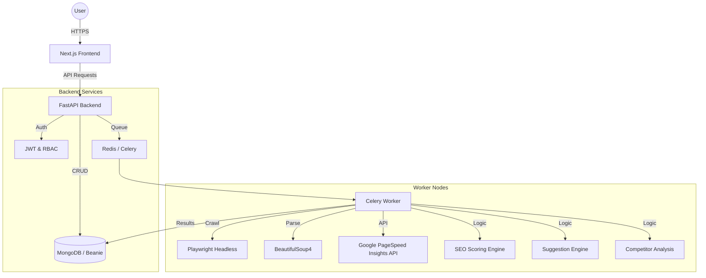

# System Architecture: SEO Audit SaaS Platform

## High-Level Overview

## Component Breakdown

### 1. Frontend (Next.js 14+)
- **App Router**: Modern React patterns for routing and layout.
- **TanStack Query**: Efficient data fetching, caching, and state management.
- **TailwindCSS**: Utility-first CSS for a responsive, world-class UI.
- **Recharts**: Data visualization for SEO and performance metrics.
- **Auth Flow**: Secure JWT handling with Axios interceptors.

### 2. Backend (FastAPI)
- **Async API**: High-performance, asynchronous endpoints.
- **Beanie ODM**: MongoDB object-document mapping with Pydantic v2.
- **JWT Auth**: Secure authentication and role-based access control.
- **Service Layer**: Decoupled business logic (Scoring, Performance, Competitors).

### 3. Background Processing (Celery + Redis)
- **Distributed Tasks**: Scans run outside the request-response cycle.
- **State Management**: Redis as the broker and result backend.
- **Playwright**: Robust headless crawling for JavaScript-heavy sites.

### 4. Database (MongoDB)
- **Collections**:
  - `Users`: Identity and account details.
  - `Scans`: Results of SEO audits and performance checks.
  - `Domains`: Tracked websites and competitor lists.
  - `Jobs`: Task status and progress tracking.

## Scalability Strategy
- **Horizontal Scaling**: Backend and Worker services are stateless and can be scaled horizontally using Docker Swarm or Kubernetes.
- **Database Scaling**: MongoDB supports sharding for handling millions of scan records.
- **Caching**: Redis is used for job status and can be extended for API response caching.
